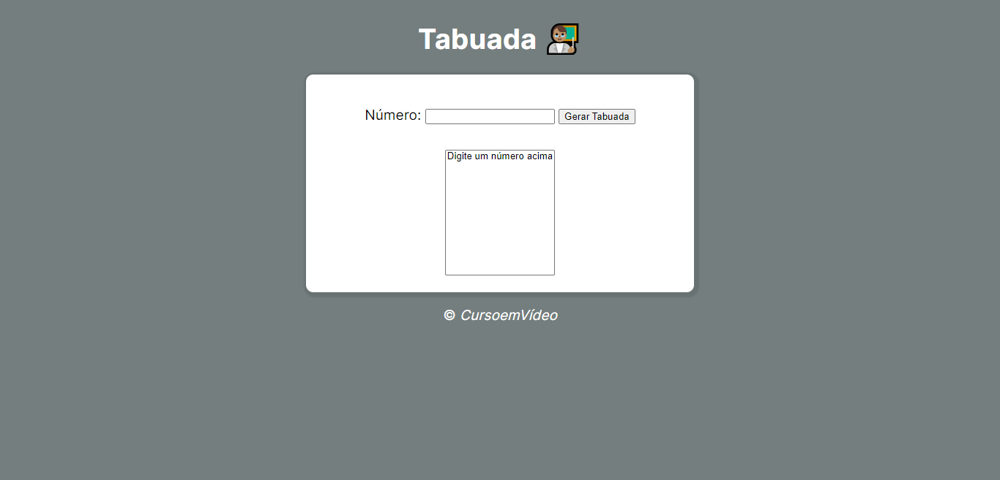
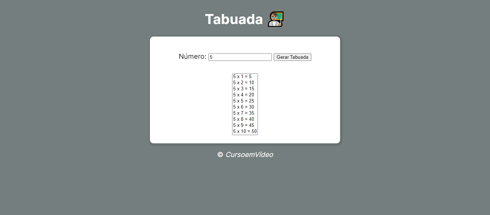

# Curso de JavaScript

>Programa - Tabuada

### Antes de digitar o valor:

### Após digitar o valor:

Projeto desevolvido através dos conhenhecimentos obtidos no cursos lecionados pelo professor Gustavo Guanabara, Curso em Vídeo.

[🔗 Clique aqui para acessar](https://ramonbarret.github.io/tabuada/)

## 🛠 Tecnologias

- HTML5
- CSS3
- JavaScript
- Git e Github

## 📲 Contato

Email: ramon_barreto_medrado@hotmail.com